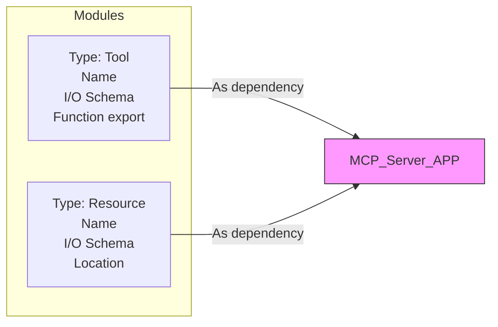
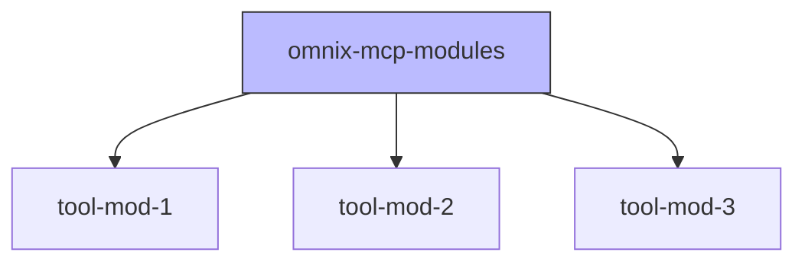
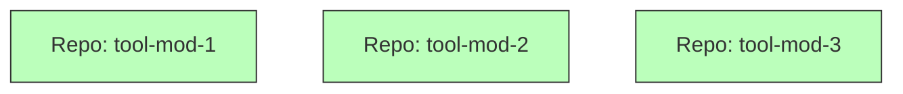

# 📖 Índice

## Propuesta tools/res como dependencias y manejo de repo

- [🧩 Estructura de MCP Tools](#-estructura-de-mcp-tools)
- [Opción 1: Repositorio Único (Monorepo)](#opción-1-repositorio-único-monorepo)
  - [📊 Diagrama Mermaid (Opción 1):](#-diagrama-mermaid-opción-1)
- [Opción 2: Repositorios Independientes (Multirepo)](#opción-2-repositorios-independientes-multirepo)
  - [📌 Posible approach:](#-posible-approach)

## Propuesta de buenas prácticas

- [📖 1. Entender y Documentar el Caso de Uso](#-1-entender-y-documentar-el-caso-de-uso)
  - [🔹 Propósito Claro y Definido](#-propósito-claro-y-definido)
  - [🔹 Requerimientos Claros y Definidos](#-requerimientos-claros-y-definidos)
- [🔧 2. Requerimientos del MCP](#-2-requerimientos-del-mcp)
  - [🔹 Herramientas para acciones](#-herramientas-para-acciones)
  - [🔹 Recursos para operaciones de sólo lectura](#-recursos-para-operaciones-de-sólo-lectura)
- [🏷️ 3. Nombres Intuitivos y Claros](#-3-nombres-intuitivos-y-claros)
  - [🔹 Nombres descriptivos para herramientas](#-nombres-descriptivos-para-herramientas)
  - [🔹 Seguir Naming Conventions](#-seguir-naming-conventions)
- [📐 4. Definición Clara y Precisa de Esquemas I/O](#-4-definición-clara-y-precisa-de-esquemas-io)
  - [🔹 Marcar requeridos en los schemas](#-marcar-requeridos-en-los-schemas)
  - [🔹 Simplificación de los schemas](#-simplificación-de-los-schemas)
  - [🔹 Simplificar datos externos](#-simplificar-datos-externos)
- [📦 5. Uso de SDK Oficiales y Actualizados](#-5-uso-de-sdk-oficiales-y-actualizados)
- [🔐 6. Almacenamiento Seguro (Secure Vaults)](#-6-almacenamiento-seguro-secure-vaults)
- [🔑 7. Autenticación con Sistemas Externos](#-7-autenticación-con-sistemas-externos)
- [🚨 8. Manejo de Errores y Excepciones](#-8-manejo-de-errores-y-excepciones)
  - [🔹 Mensajes de error claros para AI](#-mensajes-de-error-claros-para-ai)
  - [🔹 Mapeo de errores externos](#-mapeo-de-errores-externos)
  - [🔹 Estrategias de Retries](#-estrategias-de-retries)
- [🚀 9. Rendimiento y Optimización](#-9-rendimiento-y-optimización)
  - [🔹 Uso de cachés](#-uso-de-cachés)
  - [🔹 Límites de APIs externas](#-límites-de-apis-externas)
  - [🔹 Procesos Asíncronos](#-procesos-asíncronos)
- [📋 10. Gestión y Estructura de Logs](#-10-gestión-y-estructura-de-logs)
- [🛡️ 11. Pruebas de Lógica y Seguridad](#-11-pruebas-de-lógica-y-seguridad)
- [📚 12. Documentación Detallada de las Herramientas (Tools)](#-12-documentación-detallada-de-las-herramientas-tools)
  - [🔧 Herramienta: obtener_estado_pedido](#-herramienta-obtener_estado_pedido)
- [🚧 13. Pasos de Instalación y Uso del MCP Server](#-13-pasos-de-instalación-y-uso-del-mcp-server)


# 🛠️ Guía de Buenas Prácticas para Implementación de MCP Servers - Omnix IA

Este documento establece los lineamientos claros para implementar MCP Servers de forma efectiva, segura y eficiente en Omnix IA.

---

## 📖 1. Entender y Documentar el Caso de Uso

### 🔹 Propósito Claro y Definido
- Define claramente el objetivo del MCP Server.
- Describe qué problemática específica resolverá.
- Detalla cómo este servidor mejorará la eficiencia o desempeño del agente AI.

### 🔹 Requerimientos Claros y Definidos
- Especifica detalladamente todos los requerimientos técnicos y funcionales del servidor.
- Incluye dependencias con otros sistemas o herramientas.

---

## 🔧 2. Requerimientos del MCP

### 🔹 Herramientas para acciones
- Proporciona y documenta claramente las herramientas o APIs externas necesarias para que el agente pueda ejecutar acciones.

### 🔹 Recursos para operaciones de sólo lectura
- Define claramente cuáles recursos estarán disponibles exclusivamente para operaciones de consulta o lectura.

---

## 🏷️ 3. Nombres Intuitivos y Claros

### 🔹 Nombres descriptivos para herramientas
- Cada herramienta o acción debe tener un nombre claro y significativo (como si estuviese orientado a una persona).

### 🔹 Seguir Naming Conventions
- Acordar y documentar una convención de nombres estándar.
- **Nota**: Brandon definirá y proporcionará las convenciones específicas de nomenclatura para herramientas y acciones.

---

## 📐 4. Definición Clara y Precisa de Esquemas I/O

### 🔹 Marcar requeridos en los schemas
- Documenta explícitamente en los schemas JSON cuáles campos son obligatorios y cuáles opcionales.

### 🔹 Simplificación de los schemas
- Mantén los esquemas simplificados para reducir el consumo de tokens en interacciones con la IA.
- Evita estructuras complejas o anidadas innecesarias.

### 🔹 Simplificar datos externos
- Transforma o simplifica datos complejos provenientes de sistemas externos antes de presentarlos al agente AI.
- No siempre es necesario que los datos sean transparentes (ByPass); adapta los esquemas según la necesidad del caso de uso.

---

## 📦 5. Uso de SDK Oficiales y Actualizados
- Asegúrate de utilizar siempre SDK oficiales proporcionados por proveedores externos.
- Mantén las bibliotecas y herramientas siempre actualizadas a la última versión estable.

---

## 🔐 6. Almacenamiento Seguro (Secure Vaults)
- Utiliza gestores de secretos seguros (ej. AWS Secrets Manager, Azure Key Vault, HashiCorp Vault).
- Nunca guardes credenciales o información sensible en código o repositorios públicos.

---

## 🔑 7. Autenticación con Sistemas Externos
- El MCP Server gestionará internamente la autenticación y actualización de tokens con sistemas externos.
- Automatiza completamente la gestión del ciclo de vida de tokens.

---

## 🚨 8. Manejo de Errores y Excepciones

### 🔹 Mensajes de error claros para AI
- Define mensajes de error entendibles por el agente AI.
- Evita mensajes técnicos o códigos crípticos.

### 🔹 Mapeo de errores externos
- Mapea claramente errores provenientes de servicios externos a errores internos en el contexto de la solución MCP.

### 🔹 Estrategias de Retries
- Implementa reintentos automáticos con políticas claras y configurables para mejorar resiliencia.

---

## 🚀 9. Rendimiento y Optimización

### 🔹 Uso de cachés
- Usa cachés internos o externos (Redis, Memcached) para reducir latencia y mejorar rendimiento.

### 🔹 Límites de APIs externas
- Documenta claramente límites y restricciones de las APIs externas para evitar sobrepasarlos.

### 🔹 Procesos Asíncronos
- Utiliza procesamiento asíncrono siempre que sea posible para optimizar tiempos de respuesta.

---

## 📋 10. Gestión y Estructura de Logs
- Define una estructura estándar y clara para todos los logs generados.
- Los logs deben permitir una fácil identificación y seguimiento de problemas.

Ejemplo sugerido:

```json
{
    "timestamp": "2025-05-12T10:35:21Z",
    "level": "INFO",
    "service": "MCP-Server",
    "operation": "fetch_user_data",
    "message": "Successfully retrieved user data",
    "userId": "12345",
    "transactionId": "67890"
}
```

## 🛡️ 11. Pruebas de Lógica y Seguridad
- Implementa pruebas automatizadas que cubran lógica de negocio y validación de seguridad.
- Realiza regularmente escaneos de seguridad y auditorías internas del código.

## 📚 12. Documentación Detallada de las Herramientas (Tools)
Cada herramienta debe contar con documentación específica que contenga:

- Propósito claro: ¿Para qué sirve la herramienta?
- Ejemplos prácticos de uso: cómo y cuándo utilizar la herramienta.
- Esquema de entrada (Input Schema): documentado explícitamente en JSON.
- Esquema de salida (Output Schema): documentado explícitamente en JSON.

Ejemplo de documentación básica para una herramienta:

### 🔧 Herramienta: obtener_estado_pedido

#### Propósito:
Consultar el estado actual de un pedido en la plataforma de e-commerce.

#### Ejemplo de uso:
```json
{
  "order_id": "ABC1234"
}
```

Input Schema:
```json
{
  "type": "object",
  "properties": {
    "order_id": {"type": "string"}
  },
  "required": ["order_id"]
}
```

Output Schema:
```json
{
  "type": "object",
  "properties": {
    "status": {"type": "string"},
    "estimated_delivery": {"type": "string", "format": "date-time"},
    "tracking_link": {"type": "string"}
  },
  "required": ["status"]
}
```


---

## 🚧 13. Pasos de Instalación y Uso del MCP Server

Documenta claramente:

- Requisitos previos de software y hardware.
- Procedimientos paso a paso para la instalación.
- Configuración inicial y parámetros obligatorios.
- Instrucciones detalladas para despliegue y ejecución en producción.
- Comandos básicos para monitoreo y mantenimiento.


# 📐 Implementación de MCP Tools como Dependencias
La idea principal es mantener cada MCP Tool o recurso independiente y modular, para que puedan ser reutilizados y fácilmente añadidos como dependencias a diferentes proyectos MCP Server.

Beneficios:

- Mayor modularidad y reutilización.
- Menor acoplamiento.
- Fácil actualización y mantenimiento individual.
- Escalabilidad y flexibilidad en el desarrollo.

## 🧩 Estructura de MCP Tools
Cada MCP Tool o recurso debe tener la siguiente estructura base:

- Tipo: Indica si es una herramienta (tool) o un recurso (resource).
- Nombre: Claro e intuitivo.
- I/O Schema: JSON schemas claramente definidos.
- Función (Tool) o Ubicación (Resource): El módulo expone claramente la función (si es Tool) o la ubicación del recurso (si es Resource).

📊 Diagrama Mermaid (Implementación propuesta):



# 📁 2. Gestión de MCP Tools en Repositorios

Se presentan dos opciones de organización para manejar MCP tools dentro del control de versiones (git).

## Opción 1: Repositorio Único (Monorepo)

Descripción: Todas las herramientas en un único repositorio (omnix-mcp-modules), organizadas en carpetas.

Ventajas:
- Fácil acceso y visibilidad global.
- Menos overhead administrativo (permisos, accesos, CI/CD).
- Fácil reutilización interna.

Desventajas:
- Mayor tamaño del repositorio.
- Posible dependencia entre herramientas si no se gestionan bien.
- Riesgo de conflictos frecuentes.

### 📊 Diagrama Mermaid (Opción 1):



## Opción 2: Repositorios Independientes (Multirepo)

Descripción: Cada herramienta tiene su propio repositorio independiente (tool-mod-1, tool-mod-2, tool-mod-3).

Ventajas:
- Claridad y modularidad extremas.
- Mayor facilidad para mantener y actualizar individualmente.
- Reducción de conflictos entre herramientas.

Desventajas:
- Mayor complejidad administrativa (múltiples pipelines CI/CD, accesos, permisos).
- Posible dificultad para descubrir herramientas existentes.



### 📌 Posible approach:

Podríamos iniciar con monorepo y evaluar migración futura a multirepo según necesidades y si crecen tanto las tools que se hace necesario.